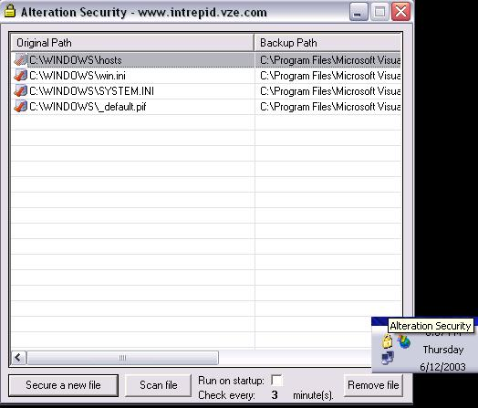



## Detect File Infection w/ Fingerprinting

### Description

Detect infection to any files on your computer with this complete program! This is my first attempt at an anti spyware/adware/trojan protector like Ad-Aware. Of course right now its no where close - it currently only fingerprints files, but with newer versions will come more advanced protection. Alteration Security allows any number of files to be monitered. Once a file is chosen it immediatly creates a backup of that file, so if an infection occurs, it offers you the option of restoring the file to its last settings. Good files to protect our files such as autoexec.bat, the hosts file, system.ini, win.ini etc... You can have it run on startup, and choose to scan the files every ___ minutes. (5 by default). I hope you enjoy it - votes and feedback appreciated!
 
### More Info
 

             |
---                |---
**Submitted On**   |2003-06-12 20:05:00
**By**             |[Intrepid Software](https://github.com/Planet-Source-Code/PSCIndex/blob/master/ByAuthor/intrepid-software.md)
**Level**          |Intermediate
**User Rating**    |5.0 (25 globes from 5 users)
**Compatibility**  |VB 5\.0, VB 6\.0
**Category**       |[Complete Applications](https://github.com/Planet-Source-Code/PSCIndex/blob/master/ByCategory/complete-applications__1-27.md)
**World**          |[Visual Basic](https://github.com/Planet-Source-Code/PSCIndex/blob/master/ByWorld/visual-basic.md)
**Archive File**   |[Detect\_Fil1600176122003\.zip](https://github.com/Planet-Source-Code/intrepid-software-detect-file-infection-w-fingerprinting__1-46139/archive/master.zip)

